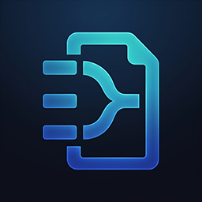
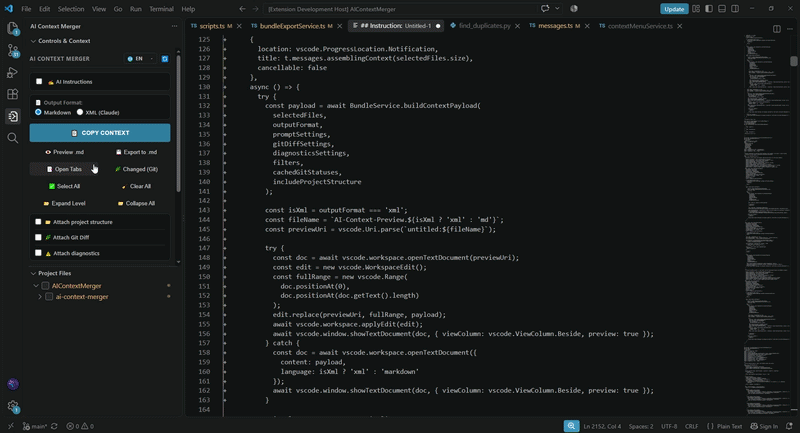
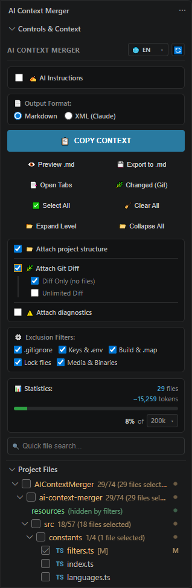

<div align="center">



# AI Context Merger

### Instant project context assembly into structured prompts for LLMs (Claude, ChatGPT, DeepSeek, Gemini)

[](https://marketplace.visualstudio.com/items?itemName=alex-developer.ai-context-merger)
[](#features)
[](https://marketplace.visualstudio.com/items?itemName=alex-developer.ai-context-merger)
[](https://opensource.org/licenses/MIT)
[](#security)

[Features](#features) • [Formats](#formats) • [Context Examples](#examples) • [Quick Start](#quickstart) • [Security](#security) • [Settings](#settings) • [Support](#support) • [Contributing](#contributing)

</div>

---

> 💡 **What's the problem with existing approaches?**
> * ⏳ **Manually via clipboard:** Copying dozens of tabs is tedious, strips directory structure, and makes it easy to accidentally leak `.env` files, API tokens, or multi-megabyte lockfiles into your prompt.
> * 📟 **Via console CLI tools:** The terminal lacks visual clarity. It is hard to see what will actually go into the bundle, cherry-picking scattered files is awkward, and you have to constantly switch between your editor and command line.
>
> **The Solution:** **AI Context Merger** solves both problems - an interactive file tree, smart secret filtering, and instant clean context assembly in a couple of clicks directly inside your editor.

---

## 🎬 Demo

<div align="center">
  

  <br/>

  <details>
    <summary><b>🔍 Click to view full sidebar interface & controls</b></summary>
    <br/>
    
    <p><em>Full sidebar: Controls & Context panel, live token statistics, and native Project Files tree</em></p>
  </details>
</div>

---

## <a id="features"></a>✨ Key Features

### 📁 Frictionless File Selection
* **Open Tabs:** Add all files currently active in editor tabs with a single click.
* **Git Changes (Changed):** Instantly isolate created, modified, or deleted `[D]` working tree files.
* **Interactive Project Tree:** Smooth navigation, checkboxes for files and folders, and selected item count badges.
* **Live Search:** Filter project structure by filename with the ability to select search results in bulk.
* **Multi-Root Workspace Support:** Accurate path resolution and folder prefixes for multi-folder projects and monorepos.

### 🛡️ Rock-Solid Protection Against Leaks and Bloat
* **Secret Isolation:** Automatic exclusion of `.env`, `*.pem`, `*.key`, `id_rsa`, `credentials.json`, and other sensitive configuration files.
* **Build Artifact Filtering:** Automatic exclusion of lockfiles (`package-lock.json`, `pnpm-lock.yaml`, `Cargo.lock`, etc.), source maps (`*.map`), minified bundles, and media/binary files.
* **Corrupted Encoding Protection (Mojibake):** Automatic encoding detection, recovery of legacy Cyrillic files (`Windows-1251`, `CP866`), and replacing unreadable mojibake with a safe placeholder.
* **Magic Bytes Binary Detection:** Deep binary signature inspection prevents unreadable machine code from polluting context (even if disguised with a `.txt` extension).
* **Full `.gitignore` Compliance:** Files excluded by version control are guaranteed never to enter your prompt.
* **Symlink Traversal Guard:** Strictly forbids traversing symbolic links, preventing circular recursion loops and workspace boundary escapes.

### 🌿 Git Diff & Code Review Mode
* Include unified diffs for selected files (including automatic diff synthesis for newly created untracked files).
* **Diff Only Mode:** Send only project structure and diffs without full file source code (ideal for Code Reviews and regression analysis).
* Configurable diff size threshold to protect against context bloat.

### ⚠️ Compiler & Linter Diagnostics
* Include compiler errors (`TypeScript`, `rustc`, `clang`, `mypy`) and linter warnings (`ESLint`, `Ruff`, `Biome`) with precise line and column numbers directly into the context.
* The LLM immediately sees the exact failure location and delivers a targeted fix without unnecessary back-and-forth.

### 📊 Real-Time Token & Budget Calculation
* Accurate character count and estimated token volume (`~chars / 4`).
* Interactive usage progress bar tailored for context windows: **32k, 64k, 128k, 200k, 1M, 2M**.
* Dynamic color-coded thresholding and model context overflow warning.

### 👁️ Preview, Export & Save
* **Quick Preview:** Review assembled Markdown or XML side-by-side in a split editor tab before sending.
* **Export to File:** Save ready-to-use context to local disk (`.md` or `.xml`) with one click.

### ✍️ Built-in & Custom Prompts
* Ready-to-use scenarios: **Bugs**, **Refactor**, **Tests**, **Docs**, **Fix Diagnostics**, **PR Review**, **New Feature**, **Explain Code**.
* Create, edit, and delete custom presets with automatic synchronization via VS Code Settings Sync.

### 🌍 Complete Internationalization (i18n)
* Interface and system messages are fully localized into **7 languages**: English, Русский, 简体中文, Español, Português (Brasil), 日本語, Deutsch.
* Automatic editor language detection (`auto`) or manual selection directly in the panel header.

---

## <a id="formats"></a>📄 Format Comparison: Markdown vs. XML

AI Context Merger supports two optimized output formats:

| Format | Recommended Models | Implementation Details |
| :--- | :--- | :--- |
| **Markdown** | ChatGPT, DeepSeek, Gemini, Perplexity | Familiar syntax, language syntax highlighting, and structure collision protection using dynamic code fences (4+ backticks ````). |
| **XML** | Anthropic Claude 3 / 3.5 / 3.7 (Haiku, Sonnet, Opus) | Official Anthropic prompting standard. `<document>` tags, content isolation via `<![CDATA[...]]>`, and entity escaping. |

---

## <a id="examples"></a>📦 Context Examples

> ℹ️ **Each section is configured independently:**
> * **Instructions (AI Instructions):** Toggle on/off or populate with preset templates.
> * **Project Tree (Project Structure):** Toggle via the *"📁 Attach project structure"* checkbox.
> * **Git Diff:** Enabled with the *"🌿 Attach Git Diff"* option. In *"Diff Only"* mode, full file code is omitted.
> * **Diagnostics:** Enabled with the *"⚠️ Attach diagnostics"* option, with selective inclusion of compiler and linter issues.
> * **Deleted Files `[D]`:** Marked with `[File deleted in Git]`, preserving architectural context integrity.

### 1. Markdown Format

<details open>
<summary><b>Expand Markdown Document Example</b></summary>

`````markdown
## Instruction:
Refactor the authentication middleware, fix the compiler errors from the Diagnostics block, and review the changes in the Git Diff for potential token leaks.

---

Project Structure:
└── src/
    ├── controllers/
    │   └── auth.controller.ts [M]
    ├── middleware/
    │   └── auth.middleware.ts [U]
    ├── legacy/
    │   └── oldTokenValidator.ts [D]
    └── types/
        └── auth.types.ts [R]

---

## Git Diff:
```diff
diff --git a/src/controllers/auth.controller.ts b/src/controllers/auth.controller.ts
--- a/src/controllers/auth.controller.ts
+++ b/src/controllers/auth.controller.ts
@@ -12,3 +12,5 @@ export async function login(req: Request, res: Response) {
-  const token = generateOldToken(user);
+  const token = await generateJwtToken(user);
+  res.cookie('auth_token', token, { httpOnly: true, secure: true });
 }
```

---

## Problems & Diagnostics:
- src/controllers/auth.controller.ts:13:23 - [tsc] Compiler Error: Cannot find name 'generateJwtToken'. Did you mean 'generateOldToken'? (2552)
- src/middleware/auth.middleware.ts:8:7 - [eslint] Linter Warning: 'payload' is defined but never used. (@typescript-eslint/no-unused-vars)

---

## File path: src/controllers/auth.controller.ts
## File name: auth.controller.ts
## File content:
```typescript
import { Request, Response } from 'express';

export async function login(req: Request, res: Response) {
  const user = req.body;
  const token = await generateJwtToken(user);
  res.cookie('auth_token', token, { httpOnly: true, secure: true });
  return res.json({ success: true });
}
```

---

## File path: src/middleware/auth.middleware.ts
## File name: auth.middleware.ts
## File content:
```typescript
import { Request, Response, NextFunction } from 'express';

export function verifyToken(req: Request, res: Response, next: NextFunction) {
  const token = req.cookies.auth_token;
  if (!token) return res.status(401).json({ error: 'Unauthorized' });
  const payload = null;
  return next();
}
```

---

## File path: src/legacy/oldTokenValidator.ts
## File name: oldTokenValidator.ts
## File content:
[File deleted in Git]

---

## File path: src/types/auth.types.ts
## File name: auth.types.ts
## File content:
```typescript
export interface UserPayload {
  id: string;
  role: 'admin' | 'user';
}
```
`````

</details>

### 2. XML Format

<details>
<summary><b>Expand XML Document Example</b></summary>

```xml
<?xml version="1.0" encoding="UTF-8"?>
<context>

  <instructions>
<![CDATA[
Refactor the authentication middleware, fix the compiler errors from the Diagnostics block, and review the changes in the Git Diff for potential token leaks.
]]>
  </instructions>

  <project_structure>
<![CDATA[
Project Structure:
└── src/
    ├── controllers/
    │   └── auth.controller.ts [M]
    ├── middleware/
    │   └── auth.middleware.ts [U]
    ├── legacy/
    │   └── oldTokenValidator.ts [D]
    └── types/
        └── auth.types.ts [R]
]]>
  </project_structure>

  <git_diff>
<![CDATA[
diff --git a/src/controllers/auth.controller.ts b/src/controllers/auth.controller.ts
--- a/src/controllers/auth.controller.ts
+++ b/src/controllers/auth.controller.ts
@@ -12,3 +12,5 @@ export async function login(req: Request, res: Response) {
-  const token = generateOldToken(user);
+  const token = await generateJwtToken(user);
+  res.cookie('auth_token', token, { httpOnly: true, secure: true });
 }
]]>
  </git_diff>

  <diagnostics>
<![CDATA[
- src/controllers/auth.controller.ts:13:23 - [tsc] Compiler Error: Cannot find name 'generateJwtToken'. Did you mean 'generateOldToken'? (2552)
- src/middleware/auth.middleware.ts:8:7 - [eslint] Linter Warning: 'payload' is defined but never used. (@typescript-eslint/no-unused-vars)
]]>
  </diagnostics>

  <documents>
    <document index="1">
      <source>src/controllers/auth.controller.ts</source>
      <file_name>auth.controller.ts</file_name>
      <git_status>modified</git_status>
      <document_content><![CDATA[import { Request, Response } from 'express';

export async function login(req: Request, res: Response) {
  const user = req.body;
  const token = await generateJwtToken(user);
  res.cookie('auth_token', token, { httpOnly: true, secure: true });
  return res.json({ success: true });
}]]></document_content>
    </document>

    <document index="2">
      <source>src/middleware/auth.middleware.ts</source>
      <file_name>auth.middleware.ts</file_name>
      <git_status>untracked</git_status>
      <document_content><![CDATA[import { Request, Response, NextFunction } from 'express';

export function verifyToken(req: Request, res: Response, next: NextFunction) {
  const token = req.cookies.auth_token;
  if (!token) return res.status(401).json({ error: 'Unauthorized' });
  const payload = null;
  return next();
}]]></document_content>
    </document>

    <document index="3">
      <source>src/legacy/oldTokenValidator.ts</source>
      <file_name>oldTokenValidator.ts</file_name>
      <git_status>deleted</git_status>
      <document_content>[File deleted in Git]</document_content>
    </document>

    <document index="4">
      <source>src/types/auth.types.ts</source>
      <file_name>auth.types.ts</file_name>
      <git_status>renamed</git_status>
      <document_content><![CDATA[export interface UserPayload {
  id: string;
  role: 'admin' | 'user';
}]]></document_content>
    </document>
  </documents>

</context>
```

</details>

---

## <a id="quickstart"></a>🚀 Quick Start

### 📦 Installation

Install the extension via the built-in VS Code Extensions search by querying `AI Context Merger`, or run the command in your terminal:

```bash
code --install-extension alex-developer.ai-context-merger
```

---

### 🛠️ Usage

1. Open the **AI Context Merger** panel in the Activity Bar.
2. Select files using the project tree or quick action buttons: **"📑 Open Tabs"** / **"🌿 Changed (Git)"**.
3. (Optional) Define your task in the instructions field, pick a preset, or enable Git Diff / Diagnostics.
4. Click **"📋 COPY CONTEXT"** (or inspect the preview via the "👁️ Preview" button).
5. Paste the assembled result into your chat prompt with the LLM.

> 💡 **Quick actions from Explorer and Editor:**
> * Right-click any file or folder in VS Code Explorer ➔ **AI Context Merger** ➔ choose *"Add to Context"*, *"Copy Immediately"*, or *"Copy Git Diff"*.
> * The same context menu is available by right-clicking open editor tabs.
> * Clicking the `[M]` badge in the extension tree immediately opens the native Git Diff comparison.

---

## <a id="security"></a>🔒 Security & Privacy

* **100% Offline:** The extension never makes any external network requests.
* **Zero Telemetry:** No hidden tracking, analytics, or background telemetry.
* **Local Processing:** Context assembly runs entirely in-memory within VS Code, and data is only transmitted to your system clipboard or local disk.

---

## <a id="settings"></a>⚙️ Settings

Extension behavior can be configured via `settings.json`:

| Setting | Default | Description |
| :--- | :--- | :--- |
| `aiContextMerger.language` | `"auto"` | Interface language (`auto`, `en`, `ru`, `zh-cn`, `es`, `pt-br`, `ja`, `de`). |
| `aiContextMerger.defaultOutputFormat` | `"markdown"` | Default output format (`markdown` or `xml`). |
| `aiContextMerger.defaultTokenLimit` | `"200000"` | Default token budget limit for progress calculation. |
| `aiContextMerger.maxFileSizeMB` | `5` | Maximum readable file size in MB before replacing with a placeholder. |
| `aiContextMerger.maxDiffSizeKB` | `100` | Maximum Git diff size per file in KB before truncation. |
| `aiContextMerger.ignoredDirectoryPatterns` | `[...]` | List of unconditionally excluded system and build artifact directories (`node_modules`, `.git`, etc.). |
| `aiContextMerger.lockFilePatterns` | `[...]` | List of package manager lockfile names excluded when the lock files filter is active. |
| `aiContextMerger.binaryExtensions` | `[...]` | List of file extensions recognized as binary or media artifacts to exclude when the binary filter is active. |

---

## <a id="support"></a>💖 Support the Project

If **AI Context Merger** speeds up your AI workflow, you can support its development:

* Star ⭐️ the repository on [GitHub](https://github.com/ozzy-osbourne/ai-context-merger)
* Leave a review on the [VS Code Marketplace](https://marketplace.visualstudio.com/items?itemName=alex-developer.ai-context-merger)
* **Crypto Donations:**
  * **USDT (TRC20):** `TNfiXVVRiwu1jjJrxwMkhU27k4KMtvgUS2`
  * **TON / USDT (TON):** `UQBDZzT83Y_hYkKIQXGv0Elc6Y0nXlMuSYKtWgLJR1niIkxv`

---

## <a id="contributing"></a> 🤝 Contributing & Ideas

We are actively looking for community ideas, feedback, and contributions!

* 💡 **Have an idea or feature request?** Join our [GitHub Discussions](https://github.com/ozzy-osbourne/ai-context-merger/discussions) to propose new LLM formats, UI improvements, or share your thoughts before writing code.
* 🛠️ **Want to submit code?** Check out our [Contributing Guidelines](CONTRIBUTING.md) for local setup, testing commands, and requirements.

---

## <a id="license"></a>📄 License

This project is licensed under the [MIT](LICENSE) License.